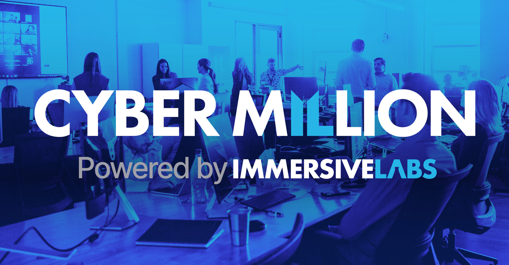

# Keeping your skills fresh

## Homelab and Linux

[AwesomeOpenSource](https://www.youtube.com/@AwesomeOpenSource) 

[CraftComputing](https://www.youtube.com/@CraftComputing)

[DrZzs](https://www.youtube.com/@DrZzs)

[JeffGeerling](https://www.youtube.com/@JeffGeerling)

[LearnLinuxTV](https://www.youtube.com/@LearnLinuxTV)

[NerdOnTheStreet](https://www.youtube.com/@NerdOnTheStreet)

[NetworkChuck](https://www.youtube.com/@NetworkChuck)

[NullByteWHT](https://www.youtube.com/@NullByteWHT)

[TechnoTim](https://www.youtube.com/@TechnoTim)

[tutoriaLinux](https://www.youtube.com/@tutoriaLinux)

 

 

## Cyber Security

[DeviantOllam](https://www.youtube.com/@DeviantOllam)

[HackerSploit](https://www.youtube.com/HackerSploit)

[hak5](https://www.youtube.com/@hak5)

[NetworkChuck](https://www.youtube.com/@NetworkChuck)

[NullByteWHT](https://www.youtube.com/@NullByteWHT)

[SANSForensics](https://www.youtube.com/@SANSForensics)

[The PC Security Channel](https://www.youtube.com/@pcsecuritychannel)

[zSecurity](https://www.youtube.com/@zSecurity)

[Professor Messer](https://www.youtube.com/professormesser)

 

 

## Programming

[FreeCodeCamp](https://www.youtube.com/@freecodecamp)

 

## Other

[LinusTechTips](https://www.youtube.com/@LinusTechTips)

---

### Cyber Fundamentals

These exercises are OPTIONAL and won't be required to apply for a job within Cyber Million. They provide additional learning to ensure that you have the basic skills needed to complete the main career path for a Defensive Security Operations role. If you are completely new to Cybersecurity these exercises will also help you to decide if a technical role is for you. Should you need any help or support please visit our Help Center. Just click the question mark icon in the top right corner, next to your profile picture or initials.
 

<a href="https://immersivelabs.online/custom-roles/3747cf987f2d46b348de74f271441b1c/collections?context=assigned-activity" target="_blank">Cyber Fundamentals</a>

 

### Defensive Security Operations

 

These exercises cover a broad range of skills needed to start a career within a Defensive Security Operations Team. Once completed you are able to apply for any of the roles within the jobs section, that have been posted by the Cyber Million Employment Partners. Complete the exercises in your own time! You can even set your own daily targets and use the "STREAKS" function to remind you to complete "a lab a day". Good luck with taking the first step to a new career in Cybersecurity. Should you need any help or support, please visit our Help Center. Just click the question mark icon in the top right corner, next to your profile picture or initials.

<a href="https://immersivelabs.online/custom-roles/7a68e6f371791aac55f844d301bdaed5/collections?context=assigned-activity" target="_blank">Defensive Security Operations </a>

 

 

### Cyber Million: Linux Command Line

Learn how to use the Linux Command Line Interface (CLI) and how it can be used to perform different tasks. The labs in this skills series range from navigating around a file structure to combining multiple commands to achieve a specific goal.

 

<a href="https://immersivelabs.online/objectives/objective/72b6ff8344617a18f4c781f7fe2edf95/labs?category=cyber-million-defensive-sec-ops" target="_blank">Linux Command Line</a>

 